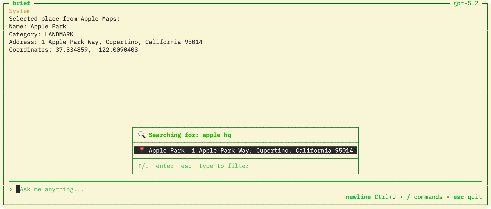

[](https://context7.com/williamagh/brief)
[](https://deepwiki.com/WilliamAGH/brief)

# Brief

A terminal ChatGPT client for fast, keyboard-first chat. Includes slash commands, tool execution, and support for OpenAI-compatible providers.


Built with [TUI4J](https://github.com/WilliamAGH/tui4j) — a Java port of [Bubble Tea](https://github.com/charmbracelet/bubbletea). Location features powered by [Apple Maps Java](https://github.com/WilliamAGH/apple-maps-java).



## Quick Start

### Homebrew (macOS)

```bash
brew install williamagh/tap/brief
brief
```

The app prompts for your API key on first launch and saves it to `~/.config/brief/config`.

For alternative providers (OpenRouter, Ollama, LMStudio), see the [configuration guide](docs/environment-variables-api-keys.md).

### GitHub Releases

Download from [releases](https://github.com/WilliamAGH/brief/releases/latest). Requires Java 25.

## Development

```bash
git clone https://github.com/WilliamAGH/brief.git
cd brief
cp .env-example .env   # add your API key
make run
```

Commands: `make run` | `make build` | `make clean`

## Contributing

[Open an issue](https://github.com/WilliamAGH/brief/issues/new) for bugs or feature requests. PRs welcome.

---

## More from William Callahan

- 

Made by [William Callahan](https://williamcallahan.com) · [Repo](https://github.com/WilliamAGH/brief)

[Other projects I've made](https://williamcallahan.com/projects)
