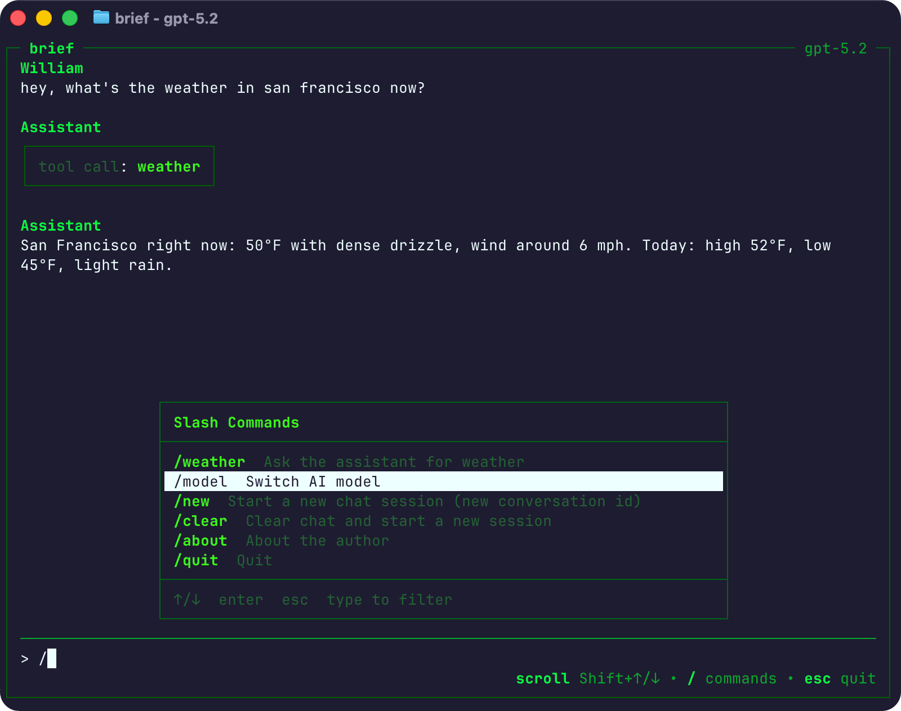
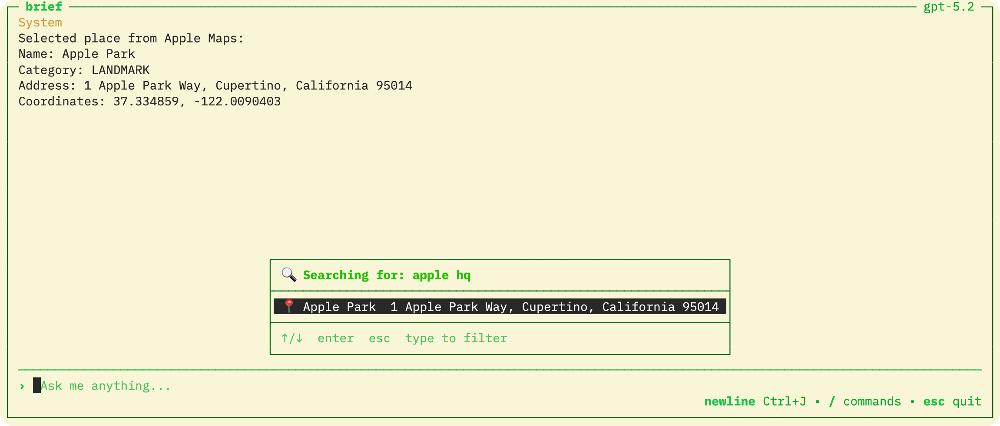

[](https://context7.com/williamagh/brief)
[](https://deepwiki.com/WilliamAGH/brief)
[](https://www.mintlify.com/WilliamAGH/brief)

[English](README.md) · [Deutsch](README_de.md)

# Brief

Ein terminalbasierter ChatGPT-Client für schnelles, tastaturorientiertes Chatten. Enthält Slash-Commands, Tool-Ausführung und Unterstützung für OpenAI-kompatible Anbieter.



Gebaut mit [TUI4J](https://github.com/WilliamAGH/tui4j) — einem Java-Port von [Bubble Tea](https://github.com/charmbracelet/bubbletea). Standortfunktionen werden von [Apple Maps Java](https://github.com/WilliamAGH/apple-maps-java) bereitgestellt.



## Schnellstart

### Homebrew (macOS)

```bash
brew install williamagh/tap/brief
brief
```

Die App fragt beim ersten Start nach Ihrem API-Schlüssel und speichert diesen in `~/.config/brief/config`.

Für alternative Anbieter (OpenRouter, Ollama, LMStudio) siehe die [Konfigurationsanleitung](docs/environment-variables-api-keys.md).

### GitHub Releases

Download von den [Releases](https://github.com/WilliamAGH/brief/releases/latest). Benötigt Java 25.

Jedes Release enthält eine Distribution-ZIP (mit Shell-Wrapper-Skripten) und ein eigenständiges Fat-JAR.
Um das JAR direkt auszuführen:

```bash
java -jar brief.jar
```

Dev-Builds: [main](https://github.com/WilliamAGH/brief/releases/tag/snapshot-main) · [dev](https://github.com/WilliamAGH/brief/releases/tag/snapshot-dev) (wird bei jedem Push aktualisiert)

### Docker

Wenn Sie Java nicht lokal installieren möchten, können Sie Brief auch über Docker ausführen.

1. **Image bauen**:
   ```bash
   ./docker/docker-setup.sh
   ```

2. **API-Key konfigurieren**:
   Erstellen Sie eine `.env`-Datei unter `~/.config/brief/.env` mit Ihrem API-Key:
   ```bash
   mkdir -p ~/.config/brief
   echo "OPENAI_API_KEY=dein_key_hier" > ~/.config/brief/.env
   ```

3. **Container starten**:
   ```bash
   docker run -it --rm --env-file ~/.config/brief/.env -v ~/.config/brief:/home/brief/.config/brief brief
   ```

#### Optional: Alias erstellen
Damit Sie `brief` einfach durch Eingabe des Namens starten können, fügen Sie dies zu Ihrer `.bashrc` oder `.zshrc` hinzu:
```bash
alias brief='docker run -it --rm --env-file ~/.config/brief/.env -v ~/.config/brief:/home/brief/.config/brief brief'
```

## Entwicklung

### Voraussetzungen

Dieses Projekt verwendet **Gradle Toolchains** mit **Temurin JDK 25** und **mise** (oder **asdf**) für reproduzierbare Builds.

**Option 1: Verwendung von mise (empfohlen)**

```bash
# Installieren Sie mise, falls noch nicht vorhanden: https://mise.jdx.dev/
mise install
```

**Option 2: Verwendung von asdf**

```bash
# Installieren Sie asdf, falls noch nicht vorhanden: https://asdf-vm.com/
asdf plugin add java https://github.com/halcyon/asdf-java.git
asdf install
```

**Was passiert**: Gradle Toolchains lädt Temurin JDK 25 beim ersten Build automatisch herunter, falls es lokal nicht vorhanden ist. Das `mise`/`asdf`-Setup stellt sicher, dass Ihre Shell und IDE die korrekte Java-Version verwenden.

### Ausführen

```bash
git clone https://github.com/WilliamAGH/brief.git
cd brief
cp .env-example .env   # API-Schlüssel hinzufügen
make run
```

Befehle: `make run` | `make build` | `make clean` | `make dist`

Weitere Details finden Sie in [docs/development.md](docs/development.md).

## Mitwirken

[Erstellen Sie ein Issue](https://github.com/WilliamAGH/brief/issues/new) für Bugs oder Feature-Anfragen. PRs sind willkommen.

---

Erstellt von [William Callahan](https://williamcallahan.com) · [Repo](https://github.com/WilliamAGH/brief)

[Andere Projekte von mir](https://williamcallahan.com/projects)
